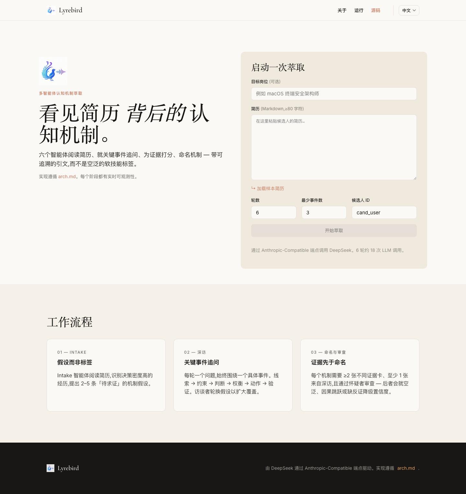
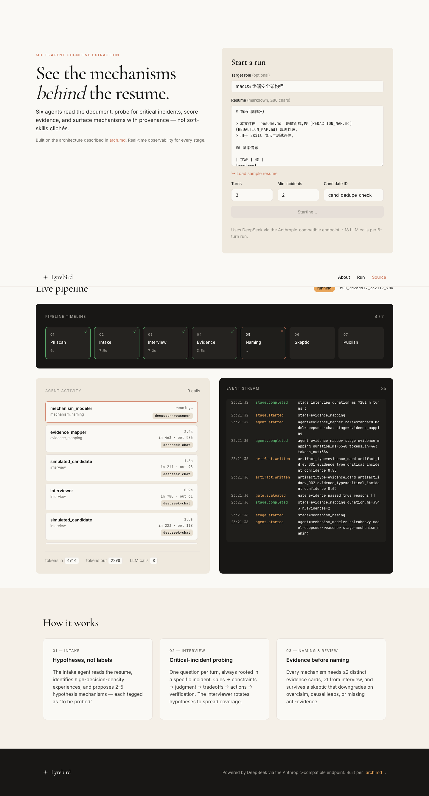

# Lyrebird

> See the mechanisms **behind** the resume. — multi-agent cognitive-mechanism extraction with a real-time observability console.

[](#testing)
[](#requirements)
[](https://api-docs.deepseek.com/)
[](#internationalization)
[](#roadmap)

<p align="center">
  
</p>

Lyrebird turns a candidate's resume into an evidence-backed extraction report. Six worker agents (Intake, Interviewer, Evidence Mapper, Mechanism Modeler, Skeptic, Report Composer) coordinated by a deterministic Orchestrator. The Skeptic downgrades over-claimed mechanisms; the Orchestrator refuses to publish anything that fails the publish gate. The final report is candidate-usable copy — resume rewrites and interview narratives — not a personality score.

Designed per [`arch.md`](arch.md). Styled per [`Design.md`](Design.md). Built test-first, memo-documented.

---

## Table of contents

- [Features](#features)
- [Quick start](#quick-start)
- [How it works](#how-it-works)
- [Documentation](#documentation)
- [Development](#development)
- [Internationalization](#internationalization)
- [Model selection](#model-selection)
- [Limitations](#limitations)
- [Roadmap](#roadmap)

---

## Features

- **Seven-stage pipeline**: PII scan → Intake → Interview → Evidence mapping → Mechanism naming → Skeptic review → Publish, with five hard gates between them.
- **Two entry points**: CLI for scripted runs, FastAPI + SSE for an interactive web console.
- **Real-time observability**: stage timeline, agent activity feed (timing + token attribution), live event stream, all over Server-Sent Events with reconnect-safe `Last-Event-ID` semantics.
- **DeepSeek V4** via the Anthropic-compatible endpoint. `deepseek-v4-pro` for naming and report writing; `deepseek-v4-flash` for everything else. Per-role override via env var.
- **Evidence chain**: every claim in the final report references a `mechanism_card`, which references `evidence_card` ids, which reference resume spans or conversation turns.
- **i18n built-in**: zh (default) + en, JSON locale files, three-tier negotiation, dropdown switcher in the nav. Adding a new language is one JSON file and a server restart.
- **129 offline tests**: every business rule has a test. CI catches schema drift, locale drift, gate weakening, and SSE reconnect duplication.
- **Honest by default**: the system would rather publish "0 validated, 1 probable, 1 needs-more-evidence" than dress up weak claims.

---

## Quick start

```bash
git clone https://github.com/<you>/lyrebird-agent
cd lyrebird-agent

# 1. Python venv + deps
python3 -m venv .venv && source .venv/bin/activate
pip install -e ".[dev]"

# 2. Configure API key
cat > .env <<'EOF'
DEEPSEEK_API_KEY=sk-...
EOF

# 3. Run the test suite (offline, no API calls)
pytest                                # 129 passed, 1 skipped

# 4. Try a real run
#    CLI mode:
python -m lyrebird.main --resume resume.redacted.md --target-role "macOS 终端安全架构师" --turns 6

#    Or web mode (open http://127.0.0.1:8765/):
uvicorn lyrebird.web.app:app --port 8765
```

A complete 6-turn run takes ~90 s and costs ~25k DeepSeek tokens.

---

## How it works

<p align="center">
  
</p>

```
┌─────────────────────────────────────────────────────────────────────┐
│  Orchestrator   (deterministic state machine, never calls an LLM)   │
└───────────────────────────────┬─────────────────────────────────────┘
                                │
        ┌───────────────────────┼─────────────────────────────┐
        ▼                       ▼                             ▼
  Intake (flash)        Interviewer (flash) ←→ Sim. candidate (flash)
        │                       │                             │
        └─────────────► Evidence Mapper (flash) ◄──────────────┘
                                │
                          Mechanism Modeler (PRO)
                                │
                            Skeptic (flash)
                                │
                          Report Composer (PRO)
                                │
                                ▼
                       ExtractionReport
```

Deterministic helpers (not LLM agents):
- **PII guard** — regex scan + redaction (`src/lyrebird/validators/pii_guard.py`)
- **Citation checker** — enforces evidence chain integrity
- **Confidence scorer** — 5-dim weighted score, blended 50/50 with model output

Every mechanism that lands in the report carries `evidence_ids`. Any claim without provenance is filtered by the publish gate.

Read [`arch.md`](arch.md) for the full architectural reasoning, and the [`memo/`](memo/) series for the implementation log.

---

## Documentation

| Doc | When to read |
|---|---|
| [`arch.md`](arch.md) | Before changing the pipeline shape, agent roles, or evidence-chain rules |
| [`Design.md`](Design.md) | Before touching any HTML/CSS |
| [`CLAUDE.md`](CLAUDE.md) | When using AI assistance — encodes the project's working mode |
| [`memo/00-overview.md`](memo/00-overview.md) | Technology choices + design principles |
| [`memo/02-skeletal-build-order.md`](memo/02-skeletal-build-order.md) | Layered build order — which file to touch for which change |
| [`memo/03-agent-design-choices.md`](memo/03-agent-design-choices.md) | Why each agent has its current shape |
| [`memo/04-real-run-walkthrough.md`](memo/04-real-run-walkthrough.md) | A real run, dissected stage by stage |
| [`memo/05-lessons-and-traps.md`](memo/05-lessons-and-traps.md) | 10 real bugs that shaped the code |
| [`memo/06-runbook.md`](memo/06-runbook.md) | CLI operator manual |
| [`memo/07-web-observability-arch.md`](memo/07-web-observability-arch.md) | Web architecture decisions (pre-implementation) |
| [`memo/08-sse-design-and-traps.md`](memo/08-sse-design-and-traps.md) | SSE protocol, three defenses, real bugs |
| [`memo/09-design-token-mapping.md`](memo/09-design-token-mapping.md) | Design.md tokens → CSS variables, acceptance checklist |
| [`memo/10-observability-runbook.md`](memo/10-observability-runbook.md) | Web operator manual |
| [`memo/11-v4-and-i18n.md`](memo/11-v4-and-i18n.md) | DeepSeek V4 migration + i18n architecture |
| [`memo/12-model-selection.md`](memo/12-model-selection.md) | flash vs pro decision framework + all-pro tradeoffs |
| [`memo/13-transparent-logo-pipeline.md`](memo/13-transparent-logo-pipeline.md) | Why chroma key is wrong, dual-threshold + un-premultiply algorithm, regen script |

---

## Development

### Requirements

- Python 3.11+
- `~/.venv` Python venv (or your preferred isolation tool)
- DeepSeek API key in `.env` (see `.env.example` if present, or use the snippet above)

No build step for the frontend — it is plain HTML/CSS/JS served from `src/lyrebird/web/static/`.

### Common commands

```bash
# All offline tests
pytest

# A single test file
pytest tests/test_schemas.py

# A single test
pytest tests/test_llm_client.py::test_complete_json_bumps_max_tokens_on_truncation

# Real-API smoke (opt-in; burns ~15k tokens)
LYREBIRD_E2E=1 pytest tests/test_pipeline_e2e.py

# Dev server with reload
uvicorn lyrebird.web.app:app --host 127.0.0.1 --port 8765 --reload

# Run with a different model per role
LYREBIRD_MODEL_HEAVY=deepseek-v4-flash uvicorn lyrebird.web.app:app
```

### Testing

129 offline tests across 14 files. The suite is **the canonical specification** — when a rule changes, the test that locks it should change too.

Anchor tests worth knowing about:
- `test_schemas::test_mechanism_card_requires_evidence` — naming gate (≥2 distinct evidence_ids)
- `test_orchestrator_logic::test_apply_review_downgrades_validated_on_high_severity` — Skeptic-driven consistency gate
- `test_llm_client::test_complete_json_bumps_max_tokens_on_truncation` — V4 thinking-block recovery
- `test_web_api::test_sse_replay_honors_last_event_id_header` — SSE reconnect dedupe
- `test_i18n::test_project_locales_have_matching_keys` — zh/en parity (run on every commit that touches locales)

### Project structure

```
lyrebird-agent/
├── arch.md, Design.md, resume.redacted.md   # design inputs (read-only)
├── img/logo.png                              # source-resolution logo
├── pyproject.toml, .env                      # project + secrets
│
├── src/lyrebird/
│   ├── schemas.py                            # Pydantic contracts, business rules as model_validators
│   ├── observability.py                      # EventBus + Event + EventType
│   ├── llm/client.py                         # DeepSeek wrapper, complete_json, V4 truncation auto-bump
│   ├── validators/                           # PII / citation / confidence (deterministic, not LLM)
│   ├── agents/                               # 7 agents + orchestrator + base
│   ├── artifact_store.py                     # JSON-on-disk artifact bus
│   ├── skills.py                             # SKILL.md loader
│   ├── i18n/                                 # locale registry + zh/en JSONs
│   ├── main.py                               # CLI entry
│   └── web/
│       ├── app.py                            # FastAPI + SSE + i18n routes
│       ├── registry.py                       # thread-pool Pipeline runner
│       └── static/                           # HTML / CSS / JS / img (no build)
│
├── skills/                                   # 6 SKILL.md modules (procedural prompt knowledge)
├── tests/                                    # 129 pytest + 1 gated E2E
├── memo/                                     # implementation log (00-12, sequential)
├── docs/screenshots/                         # UI screenshots, browser-validated
├── artifacts/                                # per-run artifact dumps (gitignored)
└── runs/                                     # per-run transcript JSONs (gitignored)
```

---

## Internationalization

The UI ships in **zh (default) and en**. Switching is via the dropdown in the top nav; choice is persisted in a cookie.

<p align="center">
  
</p>

Locale negotiation chain: `?lang=` query → `lyrebird_lang` cookie → `Accept-Language` header → default `zh`.

### Adding a new language

```bash
# 1. Copy zh as a template
cp src/lyrebird/i18n/locales/zh.json src/lyrebird/i18n/locales/fr.json

# 2. Translate every value; update meta.lang_native and meta.html_lang

# 3. Verify key coverage
pytest tests/test_i18n.py::test_project_locales_have_matching_keys

# 4. Restart server — fr now appears in the switcher automatically
```

Adding a new UI string requires touching **every** locale file (the parity test fails otherwise). This is a feature.

---

## Model selection

| Role | Model | Used by |
|---|---|---|
| `HEAVY` | `deepseek-v4-pro` | Mechanism Modeler, Report Composer |
| `STANDARD` / `FAST` | `deepseek-v4-flash` | Intake, Interviewer, Sim. Candidate, Evidence Mapper, Skeptic |

Override per role at runtime — no code change:

```bash
LYREBIRD_MODEL_HEAVY=deepseek-v4-flash      # downgrade naming + report writing
LYREBIRD_MODEL_STANDARD=deepseek-v4-pro     # upgrade all workers (slow, expensive)
```

[memo/12](memo/12-model-selection.md) explains the choice and quantifies the "should we run all-pro?" tradeoff (TL;DR: no — it triples cost and latency for marginal quality gain).

---

## Limitations

- **Single-tenant, no auth**. Don't expose the port publicly.
- **No cross-session memory**. Each run is independent; only the on-disk transcript persists.
- **Simulated Candidate is for evals only**. A real product replaces it with a human input loop.
- **Agent personas are in Chinese**. The English UI is i18n'd, but the LLM-produced content follows the input-resume language. A truly bilingual agent prompts feature is V0.4.
- **Confidence is a 5-dim heuristic, not a calibrated grader**. Eval against human raters is V0.4.
- **No `cancel` button** on the running UI yet.

---

## Roadmap

- **V0.4** — Authn + multi-tenant isolation; agent-prompt i18n; per-agent model override; human-rater eval harness.
- **V0.5** — Cross-session memory (the user comes back tomorrow and the system remembers their prior runs).
- **V1.0** — Run-list UI with history search; cancel + resume; CI/CD wiring.

---

## Credits

Built per the architectural brief in [`arch.md`](arch.md). Visual system follows the Anthropic / Claude.ai design language documented in [`Design.md`](Design.md). LLM via [DeepSeek](https://api-docs.deepseek.com/) using their Anthropic-compatible endpoint.

If you build on this code, the working mode in [`CLAUDE.md`](CLAUDE.md) is the contract that keeps it coherent — test first, memo every non-trivial decision, verify with reality.
