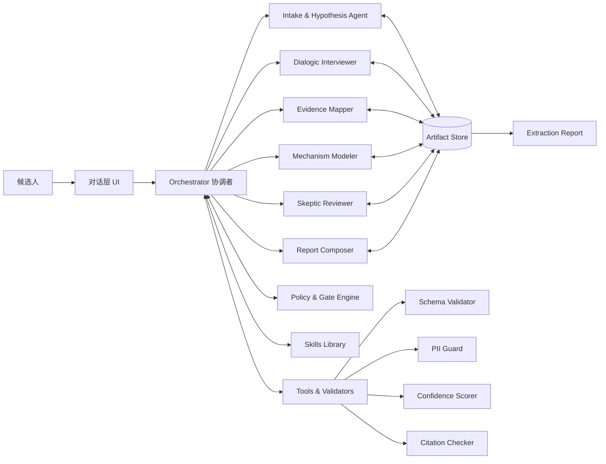
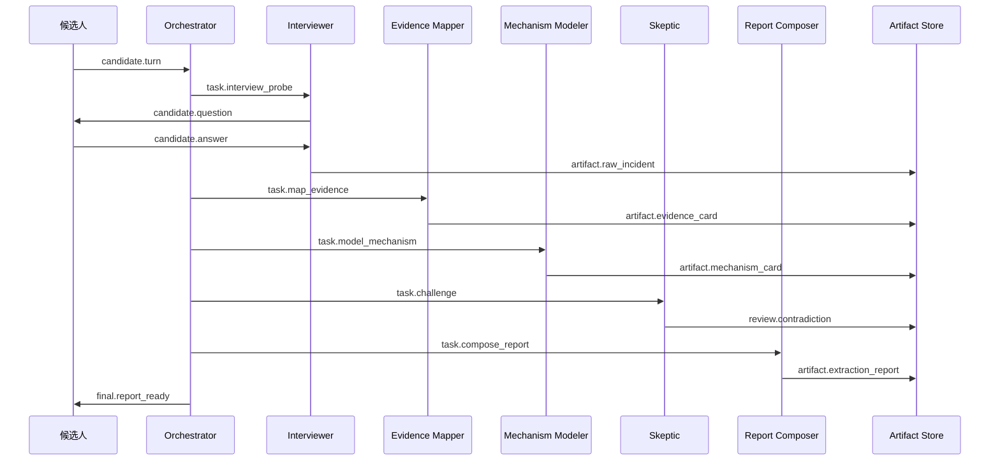

# 基于 Anthropic 多 Agent 的认知机制萃取系统设计蓝图

> 本报告聚焦于：如何把原本单一的“认知机制萃取专家 Skill”，迁移为一个可上线、可评估、可演进的 Anthropic 多 Agent 系统，用于在**纯文字互动**中帮助候选人从简历与事件回忆里看见并命名自己的高价值认知机制。  
> 研究方法上，我优先采用 Anthropic 官方文档、工程博客、官方 Skills 仓库与官方中文文档；在方法论层面，再辅以知识萃取与认知任务分析的原始论文，用来约束“如何问、问什么、如何把 tacit knowledge 变成可验证的结构化证据”。  
> 设计原则上，报告遵循 Anthropic 一贯的建议：先用**最简单可解释**的架构，只有在任务确实需要并行、隔离上下文、分工协作时才引入多 Agent；并让 Skills 承担“可复用的程序性知识”，而不是把一切都堆进一个超大系统提示里。 citeturn16view0turn16view2turn31view0turn20view2turn33view1turn33view2

## 执行摘要

对于“认知机制萃取”这类问题，**单一 Agent 并不天然最优**。原因不是“模型不够强”，而是任务同时包含了几种彼此张力很大的活动：从简历做初始假设、用追问逼近关键事件、把零散叙述压缩成证据卡、把证据卡上升为机制命名、再由怀疑者反驳与修正。Anthropic 自己在研究系统中采用了“编排者—工作者”模式，并发现这种并行、上下文隔离的结构，尤其适合需要同时追多条独立线索的广度型问题；其内部评估中，Opus 领航 + Sonnet 子代理相较单 Agent 在研究任务上有显著提升。对“认知机制萃取”来说，这种收益不会主要体现在“检索网页”，而是体现在**并行处理不同证据面向**：事件、线索、矛盾、命名、报告。 citeturn15view0turn15view1turn11view6

但这并不意味着应该把所有步骤都 Agent 化。Anthropic 在“Building effective agents”里反复强调：应先找到最简单的实现；固定、可预期、可验证的步骤更适合做成 workflow 或脚本，而不是给自由代理。对本系统而言，**PII 检测、schema 校验、置信度计算、引文覆盖检查、报告模板装配**都应优先做成确定性组件；真正适合多 Agent 的，是“带有探索性、解释性、反身性”的部分。 citeturn16view0turn16view3turn13view1turn12view3

因此，本报告的核心建议是：采用一个**扁平化、单层委派**的多 Agent 架构。运行时以 Claude Managed Agents 的 multiagent sessions 为生产主干，因为它提供了事件流、会话线程、独立上下文、版本化 agent、memory stores、内建工具、权限策略和托管运行时；而 Claude Code 的 subagents / agent teams 更适合作为本地原型与提示调试参考，其中 agent teams 目前仍是实验性能力，官方文档已明确列出会话恢复、任务协调、关闭行为等已知限制。 citeturn11view2turn14view2turn24view2turn11view5turn11view4

在知识萃取方法上，本报告建议把“高价值认知机制” operationalize 为一组可证据化的结构：**线索感知、问题框定、任务分解、权衡判断、行动路径、反馈校正**。这与认知任务分析和 Critical Decision Method 的经典目标高度一致：不是只记“做了什么”，而是追问当事人在复杂情境里**看到了什么信号、如何判断、依据了什么线索、为何没走另一条路**。也正因此，系统的提问应该围绕“关键事件”而不是泛泛自评。 citeturn33view1turn34search2turn33view2

最终，系统输出不应是“人格测试报告”或“胜任力评级”，而应是一份**带证据链的认知机制萃取报告**：每个机制都要能回溯到若干 evidence cards；每条高强度结论都要带来源、置信度、反证情况和推荐表述。这样它既能指导简历改写，也能服务后续面试叙事与自我认知深化。Anthropic 官方的 structured outputs、citations、memory versioning、permission policies 与 eval 实践，都可以直接为这类系统提供工程落点。 citeturn11view9turn19view0turn17view0turn24view0turn27view0

## 假设与架构原则

### 关键假设

| 假设类别 | 当前假设 | 设计影响 |
|---|---|---|
| 输入形态 | 最少输入为简历文本；可选输入为目标岗位 JD、候选人自述目标、过往项目材料 | Intake Agent 先做候选画像与问题假设，再决定是否进入深访 |
| 交互介质 | 全程只有文字，不使用语音、视频、屏幕共享或桌面遥测 | 必须用“事件追问 + 结构化回填 + 候选人复核”弥补非语言线索缺失 |
| 用户承诺 | 候选人愿意投入较高注意力，接受 2–4 轮较深的反思式互动 | 工作流可设计为渐进深入，而非一次性问完 |
| 任务目标 | 目标不是给出录用建议，而是帮助当事人看见并命名高价值认知机制 | 必须避免把系统变成评分器、人格筛选器或自动决策器 |
| 生产运行时 | 生产环境优先采用 Claude Managed Agents；本地调试可参考 Claude Code subagents / teams | API 级多 Agent 可用事件流、线程、内存、权限策略；本地原型可用 subagents 验证提示和分工模式 citeturn11view2turn14view2turn11view5turn11view4 |
| Skill 载体 | Skills 用来封装程序性知识、模板、脚本与参考材料，而非存候选人私有数据 | Skills 应尽量稳定、通用；候选人数据进入 session resources / files / memory stores，而不是写死在 Skill 中 citeturn20view1turn30view0turn20view3 |
| 技术限制 | API Skills 依赖 code execution；单请求最多 8 个 Skills；Skills 运行的 code execution 容器无外网且不能临时安装包 | 模块化设计需收敛到少量核心 Skills；外部实时数据应通过 web search / MCP / custom tools 获取，而非指望 Skill 内脚本联网 citeturn30view0turn19view1 |
| 隐私限制 | Skills 不属于 ZDR；Files API 上传文件会保留到显式删除；memory store 支持版本审计与 redaction | 需要明确的数据生命周期、删除策略与敏感信息最小化策略 citeturn20view3turn8search11turn17view0turn11view10 |

### 架构原则

第一，**证据先于命名**。先收集关键事件，再抽出 evidence cards，最后才做 mechanism naming。否则系统会过早贴标签，反而把候选人带入“自我故事的套话”。这与 CTA 对“线索、策略、技能、知识表示”分阶段工作的方式是一致的。 citeturn33view1

第二，**多 Agent 只用于真正需要隔离上下文与并行探索的环节**。Anthropic 明确把 workflows 与 agents 区分开：前者适合结构明晰的任务，后者适合步骤不可预先穷举的开放问题。认知机制萃取是混合任务，所以最佳实践不是“全自动多 Agent”，而是“多 Agent + workflow + scripts”的混合体。 citeturn16view0turn16view3

第三，**Skill 是程序性知识层，不是对话人格层**。Anthropic 对 Skills 的设计非常明确：Skill 本质是由 `SKILL.md`、脚本和资源构成的目录式能力包，通过 progressive disclosure 按需加载。把提问策略、证据格式、机制命名词表、报告模板分别做成小而专的 Skills，远优于一个巨型专家 Skill。 citeturn20view1turn31view0turn12view1

第四，**上下文是稀缺资源**。Anthropic 的 context engineering 明确指出，长上下文会发生“context rot”，因此应保持最小高信号上下文。对本系统而言，这意味着简历原文、候选人长篇叙事、草稿报告都不应被所有 Agent 长期携带；应通过 artifact bus、memory stores、按需读文件、压缩摘要与 progressive disclosure 来维持上下文清洁。 citeturn26view0turn20view0turn19view3

第五，**保留人类控制与透明度**。即使本系统以“自我理解”为主要目标，系统仍然会处理职业经历、组织背景和个人表达偏好等敏感信息。Anthropic 在可信代理框架里强调：人类应保有控制权、看到系统在做什么、并能在高风险动作前介入。对本系统，最重要的就是：候选人可随时终止、修正、撤回；系统在每次“命名机制”时都必须说明依据，而不是神秘地给出判断。 citeturn29view0

## 系统架构与 Agent 设计

### 推荐的生产架构选择

生产环境建议优先选择 **Claude Managed Agents + multiagent sessions**，而不是手写一个完全自管的 agent loop。原因有三点。其一，Managed Agents 已经提供了托管的 harness、工具执行、浏览、代码执行、事件流与会话管理；其二，多 Agent 能在单个 session 里用独立线程并行工作，每个线程有自己的上下文历史；其三，agent 本身是版本化资源，便于灰度和回滚。对于需要可追责、可调试、可持续迭代的“认知机制萃取”产品，这种基础设施显著降低了工程复杂度。 citeturn11view2turn24view2turn21view0turn24view3

同时，要遵守它的真实约束：Managed Agents 的 multiagent 协调只支持**一层委派**；`multiagent.agents` 最多列 20 个唯一 agent；最大支持 25 个并发 threads；所有 agent 共享同一容器与文件系统，但**上下文与工具不共享**；主 event stream 只提供跨线程的压缩视图，真正排错要钻到 thread 级别去看。正因为这样，本系统不应设计成层层嵌套的树状 agent 社会，而应采用“一个协调者 + 一组专职 worker + 外部 artifact store”的扁平模式。 citeturn14view1turn22search9turn24view3

相比之下，Claude Code 的 subagents 与 agent teams 更适合用于**本地原型期**。subagents 的价值在于上下文隔离、工具权限限制与专门系统提示；agent teams 的价值在于共享任务与直接互相发消息。但 agent teams 目前仍属实验能力，Anthropic 官方中文文档已明确说明其存在会话恢复、任务协调与关闭行为的已知限制，因此不宜直接照搬为生产运行时。 citeturn11view4turn11view5

### 系统架构图



这张图对应 Anthropic 当前最稳妥的思路：用一个协调者负责任务分解与综合，用专门 worker 在各自上下文中工作，再把跨 Agent 的共享事实外部化到 artifacts，而不是寄希望于隐式共享上下文。Anthropic 在 Research 系统里也采用了 orchestrator-worker 模式，并强调 subagent 应该拿到明确目标、输出格式、边界与工具指导，否则极易重复劳动或漏项。 citeturn15view1turn11view3

### Agent 列表与职责

| Agent | 核心职责 | 推荐模型 | 主要输入 | 主要输出 | 主要 Skill / Tool |
|---|---|---|---|---|---|
| Orchestrator 协调者 | 任务分解、代理编排、阶段切换、最终综合 | Opus | candidate_profile、阶段状态、gate 结果 | task briefs、gate decisions、final synthesis | orchestration-skill、memory、event stream |
| Intake & Hypothesis Agent | 解析简历，形成初始能力假设与访谈优先级 | Sonnet | 简历文本、JD、目标 | candidate_profile、hypothesis list | resume-normalization-skill、structured outputs |
| Dialogic Interviewer | 围绕关键事件深挖线索、约束、判断、动作与反事实 | Sonnet | hypothesis list、candidate turns | raw incidents、clarification requests | incident-probing-skill |
| Evidence Mapper | 把叙述压缩为 evidence_card，标注来源、线索、动作、结果 | Haiku / Sonnet | 对话 transcript、resume spans | evidence_cards | evidence-schema-skill、JSON schema |
| Mechanism Modeler | 将证据聚类、命名、定义高价值认知机制 | Sonnet | evidence_cards | mechanism_cards | naming-taxonomy-skill |
| Skeptic Reviewer | 找反例、重复证据、命名漂移、因果跳跃与自我美化 | Sonnet | mechanism_cards、raw evidence | contradictions、repair tasks、confidence deltas | skeptic-checklist-skill |
| Report Composer | 生成最终萃取报告与面试/简历应用建议 | Sonnet / Opus | validated mechanism_cards、candidate goals | extraction_report | report-authoring-skill |

模型建议参考了 Anthropic 自身“Opus 作为 lead、Sonnet 作为 subagents”的模式，但我做了一个更保守的落地调整：把最重的综合与判定交给 Opus，把大部分交互、建模、审查交给 Sonnet，把高频结构化抽取尽量下放到 Haiku 或脚本，以控制成本。Anthropic 也明确建议按任务难度做 routing 与 escalation，而不是所有子任务都用最强模型。 citeturn15view1turn16view3

### 每个 Agent 的示例提示模板

Anthropic 官方提示工程建议强调：角色要明确、结构要清晰、复杂输入最好用 XML tags 分段，且对子代理何时生成、何时不生成要写出明确规则。以下模板遵循这一原则，但内容是为“认知机制萃取”定制的业务提示骨架。 citeturn25view0turn25view1turn25view3turn13view3

#### Orchestrator 协调者

```text
<role>
你是认知机制萃取系统的协调者，不直接下结论，先分配任务，再综合。
</role>

<goal>
最大化帮助候选人看见并命名自己的高价值认知机制。
</goal>

<delegation_rules>
只有在以下情况下才委派：
1. 需要并行分析多个独立证据面向；
2. 需要上下文隔离避免污染；
3. 需要独立反驳或独立命名。
不要把 schema 校验、PII 检查、置信度计算委派给自由代理。
</delegation_rules>

<output_contract>
每次综合只输出：
- 当前阶段
- 已确认事实
- 未解决问题
- 下一步委派任务
</output_contract>
```

#### Intake & Hypothesis Agent

```text
<role>
你是简历理解与假设生成专家。
</role>

<input>
候选人的简历、目标岗位、求职目标。
</input>

<task>
从简历中提取：
- 反复出现的任务类型
- 决策密度高的经历
- 可能存在但尚未命名的认知优势
不要给人格评价，不要给录用建议。
</task>

<output>
candidate_profile + hypothesis_list
</output>
```

候选人可见的示例开场：

> “我先不会总结你的‘优点’，而是先找出最值得深挖的经历。你简历里有三类事件特别可能藏着高价值认知机制：跨部门协调、从 0 到 1 的项目推进、以及复杂问题排障。你更愿意先从哪一类开始？”  

#### Dialogic Interviewer

```text
<role>
你是关键事件追问者，目标是从具体事件中逼近线索、判断与动作。
</role>

<method>
优先追问“关键事件”，不要接受空泛自评。
每次只追一个缺口：线索、约束、判断、权衡、动作、验证、反事实。
</method>

<style>
问题要短、具体、可回答，避免一次问五件事。
必要时要求候选人用“当时发生了什么”而不是“我一般会”来回答。
</style>
```

示例对话：

> 候选人：“我比较擅长推进复杂项目。”  
> Agent：“先不要总结成能力。请讲一个你介入前就已经乱掉的项目：当时的目标、最硬的约束、最早让你意识到问题不对劲的三个信号，分别是什么？”  

这种“围绕非例行动作的回顾式追问”与 CDM/CTA 的关键思想一致：用情境、线索与决策点把 tacit knowledge 拉到可叙述层。 citeturn34search2turn33view1

#### Evidence Mapper

```text
<role>
你是证据结构化专家。
</role>

<task>
把候选人的叙述压缩为 evidence_card。
每张卡必须包含：情境、目标、约束、关键线索、判断、动作、结果、来源位置。
如果证据不足，明确标记 insufficiency_reason。
</task>

<rule>
不得发明结果；不得把“候选人的自我评价”当作高强度证据。
</rule>
```

候选人可见的补问示例：

> “你刚才说‘我判断这个问题不是执行问题，而是指标定义出了偏差’。这个判断当时是基于哪两个信号？如果把那两个信号拿掉，你还会做同样判断吗？”  

#### Mechanism Modeler

```text
<role>
你是认知机制命名者。
</role>

<task>
根据 evidence_cards 提出可命名的机制，但每个命名都要满足：
- 能解释至少两个不同情境中的表现；
- 不是空泛软技能；
- 能拆成“线索 → 框定 → 动作原则 → 校正方式”。
</task>

<output>
mechanism_cards，包含别名、反例、适用边界与简历/面试表达建议。
</output>
```

候选人可见的命名验证示例：

> “基于你两个项目里的共同模式，我现在不想把它叫‘沟通能力’，而更想叫‘约束建模后再推进执行’。这个名字你觉得哪里贴切，哪里不贴切？请给我一个支持例子和一个反例。”  

#### Skeptic Reviewer

```text
<role>
你是怀疑者，不负责创造新机制，只负责找问题。
</role>

<checklist>
检查：
- 是否同一段证据被重复当成多个独立证据
- 命名是否过宽
- 是否把结果归功于个人而忽略团队/环境
- 是否存在更简单的解释
- 是否缺少反证
</checklist>
```

候选人可见的示例追问：

> “如果你没在场，这件事是否也可能在别人推动下变好？如果答案是会，那你真正独特的那一步是什么？”  

#### Report Composer

```text
<role>
你是职业化表达编辑器。
</role>

<task>
把 validated mechanism_cards 写成 extraction_report。
报告必须区分：
- 已验证机制
- 高概率机制
- 待验证假设
并为每个机制附上简历改写句式、面试回答句式和适用岗位场景。
</task>
```

候选人可见的确认示例：

> “我会把‘已验证机制’和‘待验证机制’分开写。这样你在改简历时不会把仍然模糊的优势写得过满。下面这三个标题里，哪个最接近你愿意在面试中公开使用的表达？”  

## 通信协议与数据契约

### 协议设计思路

Anthropic Managed Agents 的会话通信本身就是**事件驱动**的：应用向 session 发送 user events，系统返回 agent / session / span events，事件名遵循 `{domain}.{action}` 约定。对本产品，最稳妥的做法不是让业务层直接消费底层所有原始事件，而是在其上再封一层**业务事件协议**，把“访谈推进、证据写入、命名提案、反驳、门控判定、报告发布”这些高层活动建模出来。这样做的好处是：运行时可替换，schema 可验证，审计也更清楚。 citeturn24view3

同时，因为 multiagent sessions 中不同 agent 的上下文与工具不共享，跨 Agent 传递不应靠“你应该记得刚才别的 agent 做过什么”，而应靠**显式 artifact handoff**：要么是 JSON artifacts 写入共享文件系统 / memory store，要么是协调者生成的结构化 task brief。Anthropic 在其多 Agent 研究系统中也专门强调，应让 subagent 输出直接落入可持久化 artifact，而不是只靠“传话游戏”式摘要，以减少失真。 citeturn14view1turn15view1

### 消息流图



### 消息类型表

| 消息类型 | 发送方 | 接收方 | 负载核心字段 | 用途 |
|---|---|---|---|---|
| `candidate.turn` | 候选人 / UI | Orchestrator | `turn_id`, `text`, `phase`, `attachments` | 候选人输入 |
| `task.brief` | Orchestrator | 任一 worker | `task_id`, `goal`, `input_refs`, `output_schema`, `deadline_hint` | 委派任务 |
| `artifact.upsert` | worker | Artifact Store | `artifact_type`, `artifact_id`, `payload`, `provenance` | 写入或更新中间产物 |
| `review.request` | Orchestrator | Skeptic | `target_ids`, `review_type`, `criteria` | 请求反驳/审查 |
| `review.result` | Skeptic | Orchestrator / Store | `findings`, `severity`, `repair_actions` | 返回问题与修复建议 |
| `gate.decision` | Policy Engine | Orchestrator | `gate_id`, `status`, `reasons`, `next_action` | 阶段门控 |
| `risk.alert` | PII Guard / Validator | Orchestrator | `severity`, `object_ref`, `rule_id` | 敏感信息或格式异常预警 |
| `report.publish` | Report Composer | UI | `report_id`, `summary`, `download_token` | 发布最终报告 |

### 推荐的 schema 设计

Anthropic 的 structured outputs 支持用标准 JSON Schema 约束输出，而 strict tool use 可以进一步约束工具输入。这意味着这里的核心 artifacts 完全可以以 schema first 的方式实现：先定义结构，再让 Agent 在约束内工作，而不是先让模型自由发挥、后面再用正则打补丁。 citeturn11view9turn19view2turn8search5

#### `candidate_profile`

```json
{
  "candidate_id": "cand_001",
  "source_resume_id": "file_resume_001",
  "target_role": "高级产品经理",
  "career_stage": "mid_senior",
  "core_experiences": [
    {
      "experience_id": "exp_01",
      "company": "Example Co",
      "title": "产品负责人",
      "start": "2022-03",
      "end": "2025-01",
      "domains": ["B2B SaaS", "增长", "平台化"],
      "claimed_outcomes": ["搭建新产品线", "提升转化率"]
    }
  ],
  "hypothesis_list": [
    {
      "hypothesis_id": "hyp_01",
      "label": "约束建模驱动推进",
      "basis": ["跨部门项目反复出现", "高不确定环境中承担协调角色"],
      "priority": "high"
    }
  ],
  "unknowns": [
    "是否亲自主导关键判断",
    "成功是否主要来自组织授权而非个人机制"
  ]
}
```

#### `evidence_card`

```json
{
  "evidence_id": "ev_001",
  "type": "critical_incident",
  "source_ref": {
    "conversation_turn_ids": ["t_12", "t_13"],
    "resume_span_ref": "exp_01"
  },
  "situation": "上线前两周，多个团队对指标口径理解不一致",
  "goal": "在不延迟发布的前提下修正口径并稳定决策",
  "constraints": [
    "时间极短",
    "跨团队依赖重",
    "上层关注结果而非过程"
  ],
  "cues": [
    "不同团队使用了不同口径表",
    "核心 dashboard 与周报数字不一致"
  ],
  "judgment": "问题根因不是执行慢，而是共同事实基础缺失",
  "actions": [
    "先统一口径定义",
    "再重排推进顺序"
  ],
  "outcome": "发布如期完成，后续复盘减少口径争议",
  "confidence": 0.78,
  "insufficiency_reason": null
}
```

#### `mechanism_card`

```json
{
  "mechanism_id": "mech_001",
  "name": "约束建模后再推进执行",
  "aliases": ["先统一事实底座再推进", "结构化消解协作摩擦"],
  "definition": "面对高依赖任务时，先识别约束与事实分歧，再决定推进路径，而不是直接压执行。",
  "evidence_ids": ["ev_001", "ev_007", "ev_014"],
  "anti_evidence_ids": ["ev_021"],
  "pattern": {
    "cue_pattern": ["事实不一致", "多方目标错位", "症状像执行问题但根因更深"],
    "decision_rule": "先建模约束，再安排动作顺序",
    "verification_style": "通过统一口径、减少返工、提高后续协作稳定性来验证"
  },
  "boundary_conditions": [
    "适用于高依赖、信息不一致的复杂协作任务",
    "不适用于纯个人执行型任务"
  ],
  "confidence": 0.84,
  "status": "validated"
}
```

#### `extraction_report`

```json
{
  "report_id": "rep_001",
  "candidate_id": "cand_001",
  "summary": {
    "validated_mechanisms": 3,
    "probable_mechanisms": 2,
    "needs_more_evidence": 1
  },
  "validated_mechanisms": [
    {
      "mechanism_id": "mech_001",
      "name": "约束建模后再推进执行",
      "why_it_matters": "适合高依赖、高不确定岗位",
      "resume_rewrite": "在多方口径不一致的复杂项目中，先统一关键约束与事实底座，再重排推进路径，减少返工并提升协作效率。",
      "interview_narrative": "我不是先催执行，而是先判断事实基础是否一致；如果事实不一致，任何推进都会制造返工。",
      "evidence_ids": ["ev_001", "ev_007", "ev_014"],
      "confidence": 0.84
    }
  ],
  "probable_mechanisms": [],
  "open_questions": [
    "在资源充足的环境下，这一机制是否仍然明显"
  ],
  "privacy_notes": [
    "已移除无关个人敏感信息"
  ],
  "generated_at": "2026-05-16T10:00:00Z"
}
```

### 证据链管理规则

建议把证据链分成三层。第一层是**原始来源**：简历片段、候选人对话 turn、可选补充材料；第二层是**evidence_card**：经过最小压缩的结构化事件证据；第三层是**mechanism_card / report claim**：对证据的解释性提升。任何第三层结论，都必须能回指到至少一个二层 artifact；任何二层 artifact，都必须能回指到至少一个一层来源。这样一来，系统既能做高层综合，也不会失去可追溯性。Anthropic 的 citations 功能、memory versioning 与 event stream 都支持这种“从结论回到具体位置”的工程诉求。 citeturn19view0turn17view0turn24view3

## 阶段化工作流与质量控制

### 阶段时间线

```mermaid
gantt
    title 认知机制萃取阶段时间线
    dateFormat  X
    axisFormat %s

    section 入口
    同意与边界确认           :a1, 0, 1
    简历解析与假设生成       :a2, 1, 1

    section 萃取
    关键事件深访             :b1, 2, 2
    证据卡生成与补证         :b2, 4, 1
    机制命名与候选人复核     :b3, 5, 1

    section 质量
    怀疑者审查与修复         :c1, 6, 1
    报告编制与发布           :c2, 7, 1
```



### 分阶段工作流

阶段一是**同意与边界确认**。系统向候选人说明用途、不会做自动录用判断、不会根据敏感属性给出结论，并要求确认是否允许使用简历与后续文本作为本轮分析依据。高风险工具、外部连接器或可能出网的资源访问，默认不应打开；若一定要使用，应走显式权限策略。Anthropic 的 permission policies 就是为这种“自动执行还是先询问”而设计的。 citeturn24view0turn29view0

阶段二是**简历解析与假设生成**。Intake Agent 从简历中识别“值得追的高信息密度经历”，生成 candidate_profile 与 hypothesis_list。这里不要追求完美判断，只要为后续深访排队即可。Anthropic 建议对复杂工作用 routing 与 orchestrator-workers，把不同类别输入分流到专门提示。这里正适合一个轻量 routing：增长型经历、跨部门协同、复杂问题排障、从零搭建、对外业务推进。 citeturn16view3

阶段三是**关键事件深访**。Dialogic Interviewer 应始终围绕“一个具体事件”发问，优先追问异常信号、决策点、放弃路径、校正动作，而不是让候选人继续重复“我擅长什么”。CTA 明确强调，目标不是罗列步骤，而是识别给行为赋予情境意义的底层认知过程；CDM 也强调围绕真实、非例行事件做回顾式 probing。 citeturn33view1turn34search2

阶段四是**证据卡生成与补证**。Evidence Mapper 把叙述压成 evidence_card；若存在“动作清楚、但判断依据不清”“结果声称明确、但无来源可回指”“只有自评、没有情境”这类缺口，则回到 Interviewer 做定向追问。Anthropic 在 Skill 最佳实践中非常强调“可验证的中间产物”和“validator → fix → repeat”的反馈回路；这正适合 evidence_card 阶段。 citeturn12view3turn13view1

阶段五是**机制命名与候选人复核**。Mechanism Modeler 把多张 evidence_card 聚成 mechanism_card，但所有命名都必须回到候选人处做一次“语言贴合度校准”。因为机制命名既是分析，也是协作：如果术语太飘，候选人后续不会真正拿去改简历和讲面试。这里可以采用“给一个名字 + 一个支持例子 + 一个反例”的低负担校准法。这个阶段更像 evaluator-optimizer：Agent 先提出初版，再由候选人和 Skeptic 双重修正。 citeturn16view3turn27view0

阶段六是**怀疑者审查与修复**。Skeptic 不创造新机制，只检查已提出机制是否证据重复、范围过宽、忽略环境变量、把团队成果过度归因于个体、或缺少反证。Anthropic 在 eval 指南里明确提醒：不要僵化地按固定路径打分，而应更看重结果对不对、过程是否合理，并保留 partial credit；这非常适合拿来设计本系统的审查逻辑。 citeturn27view0

阶段七是**报告编制与发布**。Report Composer 负责把 mechanism_cards 翻译成候选人真正能用的报告：什么是已验证机制，什么还只是高概率假设，每条机制如何写进简历、如何讲进面试、适配哪些岗位场景、有哪些误用风险。建议最终同时输出“叙述版本”和“结构化版本”，以便后续接入简历改写器或 mock interview 系统。 citeturn11view9

### 质量门控与置信度规则

我建议把门控分成四道。

**充足性门**：若不到 3 个高信息密度事件，或者单个事件缺少“线索—判断—动作—结果”中的任意两项，则不能进入机制命名，只能继续补证。

**命名门**：一个 mechanism_card 至少需要 2 张非重复 evidence_card 支撑，其中至少 1 张必须来自深访事件，而不是简历静态描述。

**一致性门**：只要 Skeptic 找到未解决的强反例，该机制就不能标记为 `validated`，最多是 `probable`。

**发布门**：高置信度结论必须 100% 有 evidence_ids；报告中任何“高价值”“稀缺”“适配某岗位”的判断都必须可解释，而不是只给结论。

置信度建议采用一套**明确声明为业务规则**的分数制，而不要假装它是模型自然就有的“真概率”。例如：

| 置信区间 | 含义 | 发布策略 |
|---|---|---|
| `0.80–1.00` | 已验证机制 | 可写入报告主结论 |
| `0.60–0.79` | 高概率机制 | 可写入报告，但须标注“待更多情境验证” |
| `0.40–0.59` | 初步假设 | 只进入附录或下一轮追问清单 |
| `<0.40` | 证据不足 | 不进入正式机制列表 |

建议把置信度拆解为五个子维度：**证据丰富度、跨情境复现度、内部一致性、候选人认可度、结果链接强度**。其中“候选人认可度”不是为了迎合当事人，而是为了防止系统生成使用价值很低的命名语言。

### 错误恢复与一致性策略

| 故障类型 | 检测方式 | 恢复策略 | 一致性保障 |
|---|---|---|---|
| 结构化输出不合法 | JSON schema validator | 原 worker 原地重试一次；仍失败则换更强模型或回退到模板输出 | structured outputs + deterministic validator citeturn11view9 |
| 子任务委派含糊 | reviewer 发现重复工作或漏项 | 协调者重写 `task.brief`，补充目标、边界、输出格式 | Anthropic 明确要求 orchestrator 给 subagent 清晰 objective / boundaries citeturn15view1 |
| 证据互相矛盾 | Skeptic 返回 contradiction | 建立 `contradiction_set`，回访候选人澄清，不强行合并 | 保留反证而不是静默覆盖 |
| memory 并发写入冲突 | `content_sha256` precondition 失败 | re-read 后重试；由协调者串行化关键写操作 | memory store optimistic concurrency citeturn17view0 |
| 临时运行错误 | session status 进入 `rescheduling` | 等待系统自动重试；超过阈值再人工干预 | Managed Agents 内建状态机支持 transient retry citeturn21view0 |
| 审查模型不可用 | reviewer / advisor 返回错误 | 保持主流程继续，但把相应机制降级为 `probable` | Anthropic advisor 出错不致使整轮失败，可继续执行 citeturn18view0 |

## 安全、隐私与 Anthropic Skills 整合

### 数据隐私与敏感属性禁止规则

本系统应明确禁止以下做法：基于或推断**年龄、性别、性取向、婚育状态、种族/民族、宗教、国籍、残障/健康状况、政治立场、工会身份、生物识别特征**来给出能力判断、录用建议、匹配分或潜力分；也禁止用与岗位无关的 proxy variables 变相代入这些属性。系统的目标是**萃取认知机制**，不是做人群分类。这个边界既符合可信代理“保持人类控制、保护隐私、避免越界对齐”的原则，也能减少候选人对系统的防御感。 citeturn29view0

进一步地，系统必须将**候选人私有数据**与**组织通用程序知识**物理分离。组织通用的提问方法、报告模板、机制词表，可以进入 Skills；候选人的简历、对话记录、证据卡、机制卡和最终报告，绝不应写入 Skill 定义本身。原因很实际：Anthropic 官方文档明确说明 Agent Skills **不适用 ZDR**，而且 Skill definitions 与 execution data 按标准保留策略处理。相对而言，memory stores 支持版本审计与 redaction，Files API 也可在使用后显式删除，因此更适合承载会话级私有数据。 citeturn20view3turn11view10turn17view0turn8search11

隐私落地上，我建议采用“三层数据域”：
一层是 **Skills 域**，只放稳定的提示、流程、脚本、模板和词表；  
二层是 **会话域**，放候选人简历、对话、artifacts；  
三层是 **审计域**，只保留必要的操作日志、版本元数据和门控结果。  
如果使用 memory stores，至少拆成一个只读 reference store 和一个读写 candidate store；官方文档明确提醒，如果 agent 会消费外部不可信内容，读写 memory 可能遭到 prompt injection 污染，因此 reference 类 store 应优先 `read_only`。 citeturn17view0turn24view0

### 渐进加载与模块化实现细节

Anthropic Skills 的核心价值不是“更长的系统提示”，而是**filesystem-based progressive disclosure**：元数据总是加载，`SKILL.md` 在触发时加载，附加资源和脚本按需读取/执行，代码本身不用进入上下文。这一点对认知机制萃取尤其重要，因为它天然包含许多“并非每次都用”的内容，比如不同岗位的机制词表、不同报告模板、不同追问风格、不同组织的写作规范。 citeturn20view0turn20view1turn31view0

因此，建议不要做一个单体 Skill，而是拆成以下模块：

| Skill 模块 | 服务对象 | 内容 | 备注 |
|---|---|---|---|
| `incident-probing` | Interviewer | 关键事件追问法、追问树、坏问题清单 | 专门负责“怎么问” |
| `evidence-schema` | Evidence Mapper | evidence_card 定义、抽取示例、脚本校验器 | 强约束、低自由度 |
| `mechanism-taxonomy` | Mechanism Modeler | 命名范式、机制模板、边界条件写法 | 专门负责“怎么命名” |
| `skeptic-checklist` | Skeptic | 反证规则、重复证据判断、归因偏差提示 | 负责“怎么挑刺” |
| `report-authoring` | Report Composer | extraction_report 模板、简历表达模板、面试表达模板 | 负责“怎么写给人用” |
| `orchestration-playbook` | Orchestrator | 何时委派、何时补证、何时降级、何时发布 | 负责“怎么编排” |

Anthropic 的 Skill authoring best practices 对这里几乎是直接可用的：`description` 必须清楚写明“做什么、何时用”；`SKILL.md` 正文最好控制在 500 行以内；引用层级最好保持一层；复杂任务应写成清晰 workflow；质量关键任务要有 feedback loop；代码要 solve, don’t punt；并且至少在计划使用的模型上都做评测。 citeturn13view3turn12view1turn12view2turn13view0turn13view1turn13view4

### 与 Anthropic Skills 的整合要点

如果团队既想在 Claude Code 里本地原型，又想在 Claude API / Managed Agents 上生产部署，要特别注意 Anthropic 的**跨 surface 差异**：Custom Skills 不会跨 surface 自动同步；Claude Code 的 Skills 是文件系统本地目录；API 上的 Skills 则需要上传和版本化管理。也就是说，一个可维护的工程方案应是：**以同一 Git 仓库维护 Skills 源码**，本地开发时直接让 Claude Code 读取目录，生产发布时由 CI 打包上传到 Skills API，并在 agent 配置里按版本 pin。 citeturn20view3turn30view0

此外，Anthropic 已在 2025 年末把 Agent Skills 发布为开放标准，这意味着你完全可以把上面这些 Skills 设计成**可移植的知识资产**，而不是绑死在某一个运行时里。对产品团队而言，这会显著提高“认知机制萃取方法论”本身的复用价值。 citeturn31view0turn11view12

## MVP、里程碑与评估体系

### 里程碑路线图

| 里程碑 | 范围 | 最小可交付物 | 验收标准 |
|---|---|---|---|
| MVP | 单用户、同步流程、4 个核心角色 | Intake、Interviewer、Evidence Mapper、Report Composer；1 套 JSON schema；1 套门控；1 种报告模板 | 80% 以上会话能生成合法 `extraction_report`；每份报告至少含 2 条有 evidence_ids 的机制；无敏感属性输出 |
| V1 | 完整多 Agent、证据审查、记忆与审计 | 增加 Mechanism Modeler、Skeptic、memory store、版本审计、PII guard、置信度规则、线程级 observability | 70% 以上会话产出 3 条以上 `probable+validated` 机制；主要 contradiction 能被识别并修复；报告可直接用于简历改写 |
| V2 | 组织级 Skill 化、灰度发布、长期评估 | Skill 仓库 CI、版本 pin、A/B 测试、岗位差异化模板、个体历史会话记忆策略 | 新 Skill 版本可灰度；回归评测稳定；用户满意度与“自我命名清晰度”持续提升 |

MVP 不宜直接上多线程并发风暴。Anthropic 明确提醒，多 Agent 虽然能力更强，但也更贵、更复杂；因此 MVP 应只保留最必要的分工，先验证“事件追问 → 证据卡 → 机制命名 → 报告可用性”这一核心闭环，再逐步加入 Skeptic、较复杂的 gating 和 memory。 citeturn16view0turn15view1

### 测试与评估指标

Anthropic 的 eval 指南非常适合这里：不要只盯着一套自动分数，而要组合**自动评测、生产监控、人工审阅与用户反馈**。对本系统，我建议至少维护四类指标。 citeturn27view0

第一类是**萃取产出指标**：每次会话平均 evidence_card 数；每次会话产生的 `validated` / `probable` 机制数；每个机制的平均证据覆盖率；报告中有 evidence_ids 的高强度结论比例。

第二类是**交互质量指标**：候选人平均回答长度、有效回忆深度、关键事件填充率、补证回合数、候选人对“命名贴切度”的 5 分量表评分。

第三类是**工程可靠性指标**：schema 合法率、retry 率、session `terminated` 率、memory 冲突率、thread 级别异常率、PII 误报/漏报率。

第四类是**应用价值指标**：候选人在改写简历后对内容清晰度的自评变化、模拟面试时回答结构改善、第三方评审对“独特价值是否更清晰”的盲评。

对 grader 设计，我建议对应 Anthropic 的“三类 grader 组合”：
- **code-based graders**：schema、引用覆盖、禁止词、字段完整性、置信度阈值；
- **model-based graders**：机制命名是否具体、是否滑向空泛软技能、是否过度归因；
- **human graders**：抽样检查是否真正帮助候选人“看见并命名”了自己。  
而且要像 Anthropic 建议的那样，**读 transcript**。这类系统很容易出现“自动指标很好，但对话实际上很别扭”的情况。 citeturn27view0

### 与 Anthropic Skills 的整合验收要点

针对 Skills，本系统至少要做到以下几点才算工程上合格：

| 验收项 | 最低标准 |
|---|---|
| Skill 发现性 | 每个 Skill 的 `description` 清楚说明“做什么 + 何时用”，使用第三人称，且包含关键触发词 |
| Skill 规模控制 | 每个 `SKILL.md` 正文不超过约 500 行；长内容拆分为一层引用文件 |
| Skill 可执行性 | 所需脚本、模板、参考文件均可在受限环境中运行；不依赖临时联网安装 |
| Skill 反馈回路 | 涉及质量关键任务的 Skill 都带有 validator 或 checklist |
| Skill 跨模型测试 | 至少在目标使用的 Haiku / Sonnet / Opus 之一上完成真实用例测试 |
| Skill 发布管理 | API 版本可 pin；Claude Code 与 API surface 使用同源仓库管理 |

这些要求都直接来自 Anthropic 官方 Skill best practices，而不是“好像应该这样”。对产品团队来说，真正的门槛不是“会不会写 SKILL.md”，而是能否把知识资产写成**高发现性、低歧义、可反馈、可测试**的模块。 citeturn13view3turn12view1turn12view2turn13view1turn13view4

### 开放问题与局限

这套方案有三个仍需在真实数据中验证的点。

其一，**纯文字互动是否足以稳定萃取深层机制**。从方法论上，CTA/CDM 支持通过回顾与 probing 捕捉专家认知；但在招聘语境中，候选人会自然做自我呈现，可能导致防御性叙事。这个问题只能通过真实 transcript 评估，而不能靠静态设计完全解决。 citeturn33view1turn34search2

其二，**机制命名的“贴切”本身带有主观性**。Anthropic 也承认，代理在处理越来越主观的工作时，评估方法必须不断调整。因此最终系统最好保留“候选人语言版本”和“系统专业版本”双轨命名，而不要强制单一标签。 citeturn27view0

其三，**隐私与 Skills 的张力**。Anthropic 官方已经明确：Skills 不属于 ZDR；因此如果组织对候选人数据保留极其严格，就必须把敏感会话数据更强地约束在 session / files / memory 生命周期内，并建立自动清理与 redaction 策略。这个边界在产品立项时就应被明确，而不是上线前再补。 citeturn20view3turn11view10turn17view0

综合来看，一个面向“认知机制萃取”的 Anthropic 多 Agent 系统，正确的迁移方向并不是“把原来单 Skill 放大”，而是把它拆成**一个协调者、若干专职认知 worker、一个外部 artifact 总线、若干 deterministic validator，以及一组小而稳的 Skills 模块**。这样，AI 才不只是“会提问”，而是真正成为一个能够帮助当事人**看见、验证、命名并迁移自己的高价值认知机制**的系统。 citeturn15view1turn16view0turn20view1turn31view0